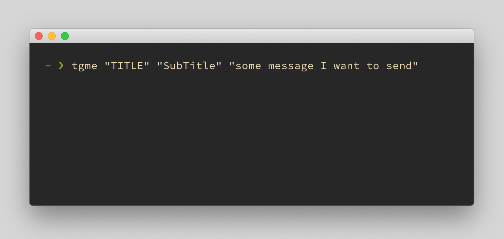
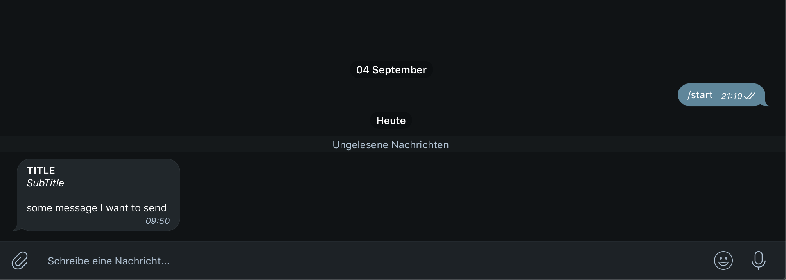

# tgme
Telegram bot written in Bash+curl to send notifications

## Source
This script was written originally by [@marcotrosi](https://github.com/marcotrosi)

## Features Added
Parsing bot token and chat id from the command line arguments

## Screenshots

## Disclaimer
This is a public repository but a private tool that I only share just in case someone needs a starting point.
Get inspired and adapt the code to your needs. USE AT OWN RISK.
